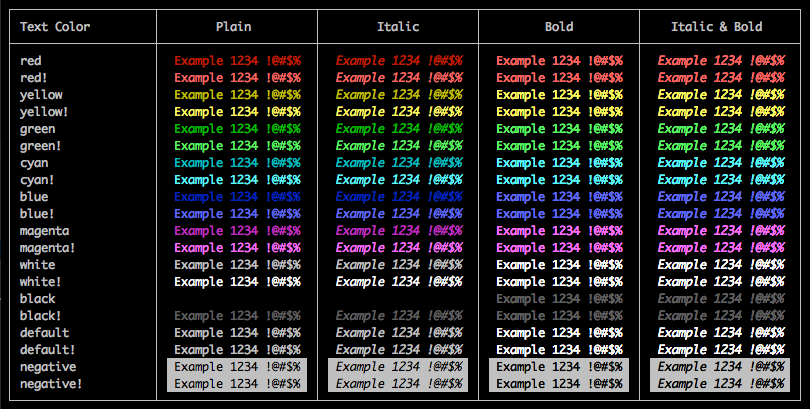
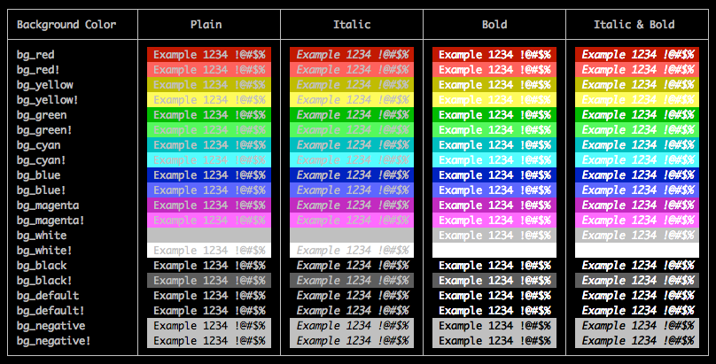
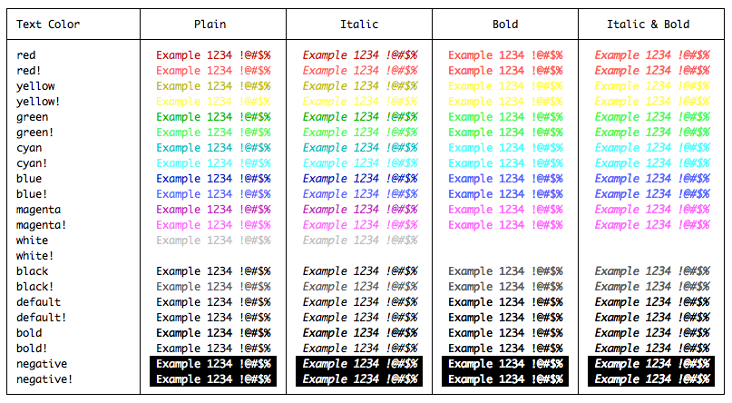
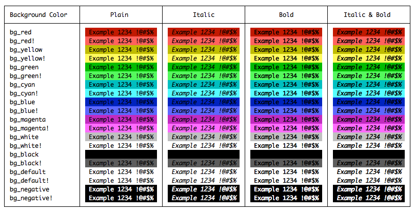

# Helidon Maven Plugin

This plugin provides Maven goals specific to Helidon applications as well as goals for general usage.

#### Goals for Helidon Applications

* [native-image](#goal-native-image)
* [jlink-image](#goal-jlink-image)

#### Goals for All Applications

* [root-dir](#goal-root-dir)
* [log](#goal-log)

## Goal: `native-image`

Maven goal to invoke GraalVM `native-image` command.

This plugin binds to the `package` phase by default.

### Optional Parameters

| Property | Type | Default<br/>Value | Description |
| --- | --- | --- | --- |
| graalVMHome | File | `${env.GRAALVM_HOME}` | GraalVM home |
| reportExceptionStackTraces | Boolean | `true` | Show exception stack traces for exceptions during image building |
| buildShared | Boolean | `false` | Build shared library |
| buildStatic | Boolean | `false` | Build statically linked executable (requires static `libc` and `zlib` |
| noServer | Boolean | `true` | Do not use image-build server |
| addProjectResources | Boolean | `true` | Indicates if project build resources should be added to the image |
| includeResources | List | [] | List of regexp matching names of resources to be included in the image |
| additionalArgs | List | [] | Additional command line arguments |
| skipNativeImage | Boolean | `false` | Skip this goal execution |
| execMode | enum | `jar` | Execution mode - `jar`, `jar-cp`, or `main` |
| mainClass | String | `${mainClass}` | Main class to use when execMode is set to `main` | 

The parameters `reportExceptionStackTraces`, `noServer`, `buildShared`,
 `buildStatic` and `skipNativeImage` are mapped to user properties of the form:
 `native.image.PROPERTY`. The parameter `siteArchiveSkip` is mapped to:
 `native.image.skip`. 
The parameter `execMode` is maped to property `native.image.execMode`.
The parameter `mainClass` is mapped to property `native.image.mainClass`.

### Specifying the path to `native-image`

There are 3 ways to specify the path to the `native-image` command:
* export `GRAALVM_HOME` in your environment
* set the `graalVMHome` Maven property (either in the pom or with -D on the
 command line)
* add the GraalVM `bin` folder to your PATH environment variable

If the plugin fails to determine the path to `native-image`, the build will
 fail with an error.

### Adding build resources

When `addProjectResources` is `true` (the default), the plugin will automatically
 add the processed project resources to the image. I.e the files from
 `src/main/resources` processed under the `target/classes` directory.

You can manually include additional files with the `includeResources` parameter.

### General usage

 A good practice would be to define an execution for this goal under a profile
 named `native-image`.

```xml
    <profiles>
        <profile>
            <id>native-image</id>
            <build>
                <plugins>
                    <plugin>
                        <groupId>io.helidon.build-tools</groupId>
                        <artifactId>helidon-maven-plugin</artifactId>
                        <executions>
                            <execution>
                                <goals>
                                    <goal>native-image</goal>
                                </goals>
                            </execution>
                        </executions>
                    </plugin>
                </plugins>
            </build>
        </profile>
    </profiles>
```

You then build your native image with the following command:

```bash
mvn package -Pnative-image
```

You can also execute this plugin outside of a configured life-cycle, however
 it requires the project jar to be present:

```bash
mvn package
mvn helidon:native-image
```

### Execution modes
#### jar
Jar execution mode uses the jar generated by this build as the target for
native-image build, and expects the jar file manifest to contain the
 `Main-Class` with the entry point, and `Class-Path` with location of all required libraries.
 
This is the default execution mode and will work with Helidon quickstart projects.

#### jar-cp
Same as `jar` mode, does not expect `Class-Path` in manifest at all.
Adds the runtime classpath to native-image build except for the `target/classes` directory,
as that is included in the built jar.

#### main
Main class execution mode uses the project classpath and a main class as an
entry point for native-image build.

## Goal: `jlink-image`

Maven goal to create a custom Java Runtime Image containing the application jars and the JDK modules 
on which they depend. In addition, it:

* Enables Class Data Sharing by default to reduce startup time. 
* Adds any missing `Jandex` indices for MP applications.
* Generates a custom `start` script to simplify CDS usage and support debug and test modes. 


This plugin binds to the `package` phase by default.

### Optional Parameters

| Property | Type | Default<br/>Value | Description |
| --- | --- | --- | --- |
| defaultJvmOptions | List | [] | JVM options to use if none are passed to the `start` script |
| defaultArgs | List | [] | Application arguments to use if none are passed to the `start` script |
| defaultDebugOptions | List | [] | JVM debug options to use if the `--debug` flag is passed to the `start` script |
| addClassDataSharingArchive | Boolean | `true` | Add a Class Data Sharing archive to reduce startup time |
| testImage | Boolean | `true` | Start the application after the image is built |
| stripDebug | Boolean | `false` | Remove all debug support from the image, including within `.class` files |
| skipJavaImage | Boolean | `false` | Skip this goal execution |

The above parameters are mapped to user properties of the form: `jlink.image.PROPERTY`.
For example `-Djlink.image.addClassDataSharingArchive=false`.

### General usage

A good practice would be to define an execution for this goal under a profile named `jlink-image`.

```xml
    <profiles>
        <profile>
            <id>jlink-image</id>
            <build>
                <plugins>
                    <plugin>
                        <groupId>io.helidon.build-tools</groupId>
                        <artifactId>helidon-maven-plugin</artifactId>
                        <executions>
                            <execution>
                                <goals>
                                    <goal>jlink-image</goal>
                                </goals>
                            </execution>
                        </executions>
                    </plugin>
                </plugins>
            </build>
        </profile>
    </profiles>
```

You then build your image with the following command:

```bash
mvn package -Pjlink-image
```

You can also execute this plugin outside of a configured life-cycle, however
 it requires the project jar to be present and will use only _default_ configuration:

```bash
mvn package
mvn helidon:jlink-image
```

## Goal: `root-dir`

Maven goal to find the top level root directory of the project and store it in a property.

This plugin binds to the `validate` phase by default.

The root directory is stored in a property `top.parent.basedir`.

### General usage

Execution of this plugin can be defined in a build of the parent project, if required
 by every module.

```xml
 <build>
    <plugins>
        <plugin>
            <groupId>io.helidon.build-tools</groupId>
            <artifactId>helidon-maven-plugin</artifactId>
            <executions>
                <execution>
                    <goals>
                        <goal>root-dir</goal>
                    </goals>
                </execution>
            </executions>
        </plugin>
    </plugins>
</build>
```

## Goal: `log`

Maven goal to log messages during a build. Supports 
[rich text](https://www.lihaoyi.com/post/BuildyourownCommandLinewithANSIescapecodes.html) via a simple DSL.

### General usage

Execution of this plugin must be explicitly bound to the desired phase, there is no default. The following example
uses the `validate` phase to log a message as early as possible:  

```xml
 <build>
    <plugins>
        <plugin>
            <groupId>io.helidon.build-tools</groupId>
            <artifactId>helidon-maven-plugin</artifactId>
            <executions>
                <execution>
                    <phase>validate</phase>
                    <goals>
                        <goal>log</goal>
                    </goals>
                </execution>
            </executions>
            <configuration>
                <messages>
                    <message></message>  
                    <message>Starting ${project.version} build</message>
                    <message></message>  
                </messages>
            </configuration>
        </plugin>
    </plugins>
</build>
```                 
Leading whitespace in messages is removed by default during XML parsing; to preserve it, add the `xml:space="preserve"` attribute:
```
    <message xml:space="preserve">    this is indented</message>
```
This attribute is especially helpful with a multi-line message to preserve indentation.

### Rich text 

Messages can be logged using colors and styles such as italic or bold. While not all terminals support this, most do; generally,
if your Maven output is in color, your messages can be as well: the same [Jansi](https://github.com/fusesource/jansi) library 
is used for both. Rich text is disabled when output is redirected or explicitly by setting `-Djansi.strip=true`; when disabled, 
only plain text is logged.  
 
Colors and styles are applied to text enclosed by `$(` and `)`, e.g.:
```
   <message>Here is $(red styled) text</message>
```                                              
In this example, the word `styled` will (normally) appear in red. If the styled text itself contains parentheses, the closing 
paren should be escaped with a backslash:
```
   <message>Here is $(red (an example of\) styled) text</message>
```                                              
The DSL syntax is:
```
   $(style[,style]* text)
```
where `style` is a case-sensitive name for a color, background color, emphasis or an alias. Nesting is supported.

#### Text Colors

 * `red`
 * `yellow`
 * `green`
 * `cyan`
 * `blue`
 * `magenta`
 * `white`
 * `black`
 * `default`
 * `bold`
 * `negative`

See [portability](#portability) for more on `default`, `bold` and `negative`.

#### Background Colors

 * `bg_red`
 * `bg_yellow`
 * `bg_green`
 * `bg_cyan`
 * `bg_blue`
 * `bg_magenta`
 * `bg_white`
 * `bg_black`
 * `bg_default`
 * `bg_negative`

#### Text Emphasis

 * `bold`
 * `plain`
 * `faint`
 * `italic`
 * `underline`
 * `strikethrough`
 * `conceal`
 * `blink`

#### Aliases  

Every text color has the following aliases:
 
 * Italic variant with `*` or `_` prefix and suffix (e.g. `_red_` or `*blue*`)
 * Bold variant with `**` or `__` prefix and suffix (e.g. `**red**` or `__blue__`)
 * Bold  variant with an uppercase name (e.g. `RED` or `BLUE`)
 * Bold italic variant with `**_` prefix and `_**` suffix (e.g. `**_red_**` or `**_blue_**`)
 * Bold italic variant with `__*` prefix and `__*` suffix (e.g. `__*red*__` or `__*blue*__`)
 * Bright variants of the color and all the above with a  `!` suffix (e.g. `red!`, `RED!`, `*red*!`, `__red__!`)

Every background color has the following alias:

 * Bright variants with a `!` suffix (e.g. `bg_yellow!`)

The `italic,bold` combination has the following aliases:
 
 * `*bold*` or `_bold_`
 * `*BOLD*` or `_BOLD_`
 * `**italic**` or `__italic__`
 * `ITALIC` 
 * Bright variants of the above with a  `!` suffix (e.g. `*bold*!`, `ITALIC!`)
 
When `bold` is used without any other color it is an alias for `default,bold`. 
 
The `negative` text color and the `bg_negative` background color are identical: they invert *both* the default text color and 
the background color.

#### Portability

Most terminals provide mappings between the standard color names used here and what they actually render. So, for example, you 
may declare `red` but a terminal _could_ be configured to render it as blue; generally, though, themes will use a reasonably 
close variant of the pure color. 

Where things get interesting is when a color matches (or closely matches) the terminal background color: any use of that color 
will fade or disappear entirely. The common cases are with `white` or `bg_white` on a light theme and `black` or `bg_black` on 
a dark theme (see [color examples](#color-examples)). While explicit use of `white` may work well in _your_ terminal setup, it 
won't work for everyone.

Portability can be addressed by using these special colors in place of any white or black style: 

 * `default`: selects the default text color in the current theme
 * `bold`: selects the bold variant of the default text color
 * `negative`: inverts the default text **_and_** background colors
 * `bg_default`: selects the default background color in the current theme
 * `bg_negative`: an alias for `negative`
 
Finally, `strikethrough`, (the really annoying) `blink` and `conceal` may not be enabled or supported in every terminal and may 
do nothing. For `conceal`, presumably you can just leave out whatever you don't want shown; for the other two best to assume 
they don't work and use them only as _additional_ emphasis.

 
#### Portable examples

```
    <message>$(RED!,italic This is a test of the emergency broadcast system.) $(bold,negative It is only a test!)</message>
    <message>$(bold,italic This is a test of the $(RED! emergency) broadcast system.)</message>
    <message>$(_bold_ This is a test of the $(RED! emergency) broadcast system.)</message>
    <message>$(negative,YELLOW!,blink  HELP! ) I've fallen, and I can't get up!</message>
    <message>This is $(CYAN!,underline REALLY IMPORTANT!)</message>
    <message>Nested: plain $(red red $(italic italic,red $(CYAN! bold,bright,italic,cyan) italic,red) red) plain</message>
```

#### Not so portable examples

```                                                             
    <message>This is $(blink important!)</message>
    <message>This is $(CYAN!,strikethrough a mistake!)</message>
```

#### Color Examples

The following tables provide examples on dark and light backgrounds within iTerm2 on MacOS.
See [here](https://en.wikipedia.org/wiki/ANSI_escape_code#3/4_bit) for examples on other terminals.

##### Text Colors: Dark Theme 



##### Background Colors: Dark Theme



##### Text Colors: Light Theme



##### Background Colors: Light Theme




