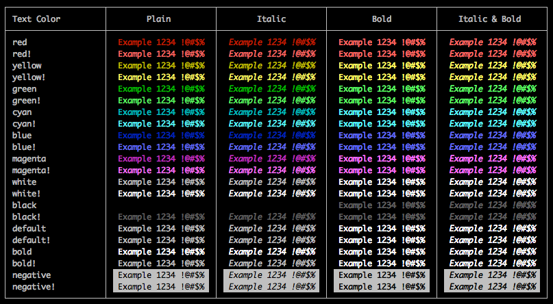
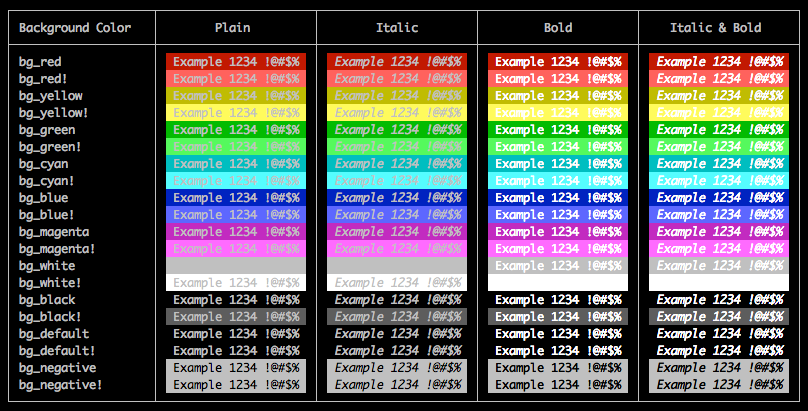
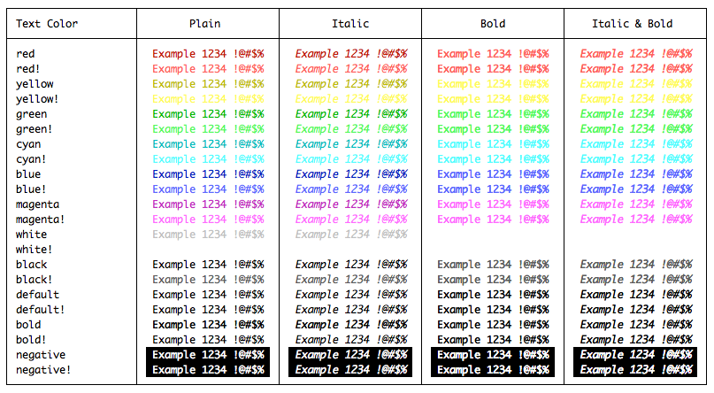

# Helidon Maven Plugin

This plugin provides Maven goals specific to Helidon applications as well as goals for general usage.

#### Goals for Helidon Applications

* [native-image](#goal-native-image)
* [jlink-image](#goal-jlink-image)
* [report](#goal-report)

#### Goals for All Applications

* [root-dir](#goal-root-dir)
* [log](#goal-log)

## Goal: `native-image`

Maven goal to invoke GraalVM `native-image` command.

This plugin binds to the `package` phase by default.

### Optional Parameters

| Property | Type | Default<br/>Value | Description                                                            |
| --- | --- | --- |------------------------------------------------------------------------|
| graalVMHome | File | `${env.GRAALVM_HOME}` | GraalVM home                                                           |
| reportExceptionStackTraces | boolean | `true` | Show exception stack traces for exceptions during image building       |
| buildShared | boolean | `false` | Build shared library                                                   |
| buildStatic | boolean | `false` | Build statically linked executable (requires static `libc` and `zlib`  |
| addProjectResources | boolean | `true` | Indicates if project build resources should be added to the image      |
| includeResources | List | [] | List of regexp matching names of resources to be included in the image |
| additionalArgs | List | [] | Additional command line arguments                                      |
| skipNativeImage | boolean | `false` | Skip this goal execution                                               |
| execMode | enum | `jar` | Execution mode - `jar`, `jar-cp`, `module`, `none` or `main`           |
| mainClass | String | `${mainClass}` | Main class to use when execMode is set to `main`                       | 
| finalName | String  | `${project.build.finalName}` | Name of the output file to be generated                                |
| jarFile | File | `target/${finalName}.jar` | Project JAR file                                                       |

Except for `skipNativeImage`, the above parameters are mapped to user properties of the form `native.image.PROPERTY`; 
`skipNativeImage` is mapped to `native.image.skip`. Multiple values for the `native.image.additonalArgs` and 
`native.image.includeResources` properties must be comma separated.

### Specifying the path to `native-image`

There are 3 ways to specify the path to the `native-image` command:
* export `GRAALVM_HOME` in your environment
* set the `graalVMHome` Maven property (either in the pom or with -D on the
 command line)
* add the GraalVM `bin` folder to your PATH environment variable

If the plugin fails to determine the path to `native-image`, the build will
 fail with an error.

### Adding build resources

When `addProjectResources` is `true` (the default), the plugin will automatically
 add the processed project resources to the image. I.e the files from
 `src/main/resources` processed under the `target/classes` directory.

You can manually include additional files with the `includeResources` parameter.

### General usage

 A good practice would be to define an execution for this goal under a profile
 named `native-image`.

```xml
    <profiles>
        <profile>
            <id>native-image</id>
            <build>
                <plugins>
                    <plugin>
                        <groupId>io.helidon.build-tools</groupId>
                        <artifactId>helidon-maven-plugin</artifactId>
                        <executions>
                            <execution>
                                <goals>
                                    <goal>native-image</goal>
                                </goals>
                            </execution>
                        </executions>
                    </plugin>
                </plugins>
            </build>
        </profile>
    </profiles>
```

You then build your native image with the following command:

```bash
mvn package -Pnative-image
```

You can also execute this plugin outside of a configured life-cycle, however
 it requires the project jar to be present:

```bash
mvn package
mvn helidon:native-image
```

### Execution modes
#### jar
Jar execution mode uses the jar generated by this build as the target for
native-image build, and expects the jar file manifest to contain the
 `Main-Class` with the entry point, and `Class-Path` with location of all required libraries.
 
This is the default execution mode and will work with Helidon quickstart projects.

#### jar-cp
Same as `jar` mode, does not expect `Class-Path` in manifest at all.
Adds the runtime classpath to native-image build except for the `target/classes` directory,
as that is included in the built jar.

#### main
Main class execution mode uses the project classpath and a main class as an
entry point for native-image build.

## Goal: `jlink-image`

Maven goal to create a custom Java Runtime Image containing the application jars and the JDK modules 
on which they depend. In addition, it:

* Enables Class Data Sharing by default to reduce startup time. 
* Adds any missing `Jandex` indices for MP applications.
* Generates a custom `start` script to simplify CDS usage and support debug and test modes. 


This plugin binds to the `package` phase by default.

### Optional Parameters

| Property | Type | Default<br/>Value | Description |
| --- | --- | --- | --- |
| defaultJvmOptions | List | [] | JVM options to use if none are passed to the `start` script |
| defaultArgs | List | [] | Application arguments to use if none are passed to the `start` script |
| defaultDebugOptions | List | [] | JVM debug options to use if the `--debug` flag is passed to the `start` script |
| additionalModules | Set | [] | Add any modules that may not be found automatically |
| addClassDataSharingArchive | boolean | `true` | Add a Class Data Sharing archive to reduce startup time |
| testImage | boolean | `true` | Start the application after the image is built |
| stripDebug | boolean | `false` | Remove all debug support from the image, including within `.class` files |
| skipJavaImage | boolean | `false` | Skip this goal execution |
| additionalJlinkArgs | List | [] | Additional arguments to use when invoking `jlink` |
| maxAppStartSeconds | int | `60` | Maximum seconds to wait for application startup |


The above parameters are mapped to user properties of the form `jlink.image.PROPERTY`, e.g.
`-Djlink.image.addClassDataSharingArchive=false`. Multiple arguments for the `jlink.image.additionalJlinkArgs` 
property must be comma separated.


### General usage

A good practice would be to define an execution for this goal under a profile named `jlink-image`.

```xml
    <profiles>
        <profile>
            <id>jlink-image</id>
            <build>
                <plugins>
                    <plugin>
                        <groupId>io.helidon.build-tools</groupId>
                        <artifactId>helidon-maven-plugin</artifactId>
                        <executions>
                            <execution>
                                <goals>
                                    <goal>jlink-image</goal>
                                </goals>
                            </execution>
                        </executions>
                    </plugin>
                </plugins>
            </build>
        </profile>
    </profiles>
```

You then build your image with the following command:

```bash
mvn package -Pjlink-image
```

You can also execute this plugin outside of a configured life-cycle, however
 it requires the project jar to be present and will use only _default_ configuration:

```bash
mvn package
mvn helidon:jlink-image
```

## Goal: `root-dir`

Maven goal to find the top level root directory of the project and store it in a property.

This plugin binds to the `validate` phase by default.

The root directory is stored in a property `top.parent.basedir`.

### General usage

Execution of this plugin can be defined in a build of the parent project, if required
 by every module.

```xml
 <build>
    <plugins>
        <plugin>
            <groupId>io.helidon.build-tools</groupId>
            <artifactId>helidon-maven-plugin</artifactId>
            <executions>
                <execution>
                    <goals>
                        <goal>root-dir</goal>
                    </goals>
                </execution>
            </executions>
        </plugin>
    </plugins>
</build>
```

## Goal: `log`

Maven goal to log messages during a build. Supports 
[rich text](https://www.lihaoyi.com/post/BuildyourownCommandLinewithANSIescapecodes.html) via a simple DSL.

### General usage

Execution of this plugin must be explicitly bound to the desired phase, there is no default. The following example
uses the `validate` phase to log a message as early as possible:  

```xml
 <build>
    <plugins>
        <plugin>
            <groupId>io.helidon.build-tools</groupId>
            <artifactId>helidon-maven-plugin</artifactId>
            <executions>
                <execution>
                    <phase>validate</phase>
                    <goals>
                        <goal>log</goal>
                    </goals>
                </execution>
            </executions>
            <configuration>
                <messages>
                    <message></message>  
                    <message>Starting ${project.version} build</message>
                    <message></message>  
                </messages>
            </configuration>
        </plugin>
    </plugins>
</build>
```                 
Leading whitespace in messages is removed by default during XML parsing; to preserve it, add the `xml:space="preserve"` attribute:
```
    <message xml:space="preserve">    this is indented</message>
```
This attribute is especially helpful with a multi-line message to preserve indentation.

### Rich text 

Messages can be logged using colors and styles such as italic or bold. While not all terminals support this, most do; generally,
if your Maven output is in color, your messages can be as well: the same [Jansi](https://github.com/fusesource/jansi) library 
is used for both. Rich text is disabled when output is redirected or explicitly by setting `-Djansi.strip=true`; when disabled, 
only plain text is logged.  
 
Colors and styles are applied to text enclosed by `$(` and `)`, e.g.:
```
   <message>Here is $(red styled) text</message>
```                                              
In this example, the word `styled` will (normally) appear in red. If the styled text itself contains parentheses, the closing 
paren should be escaped with a backslash:
```
   <message>Here is $(red (an example of\) styled) text</message>
```                                              
The DSL syntax is:
```
   $(style[,style]* text)
```
where `style` is a case-sensitive name for a color, background color, emphasis or an alias. Nesting is supported.

#### Text Colors

 * `red`
 * `yellow`
 * `green`
 * `cyan`
 * `blue`
 * `magenta`
 * `white`
 * `black`
 * `default`
 * `bold`
 * `negative`

See [portability](#portability) for more on `default`, `bold` and `negative`.

#### Background Colors

 * `bg_red`
 * `bg_yellow`
 * `bg_green`
 * `bg_cyan`
 * `bg_blue`
 * `bg_magenta`
 * `bg_white`
 * `bg_black`
 * `bg_default`
 * `bg_negative`

#### Text Emphasis

 * `bold`
 * `plain`
 * `faint`
 * `italic`
 * `underline`
 * `strikethrough`
 * `conceal`
 * `blink`

#### Aliases  

Every text color has the following aliases:
 
 * Italic variant with `*` or `_` prefix and suffix (e.g. `_red_` or `*blue*`)
 * Bold variant with `**` or `__` prefix and suffix (e.g. `**red**` or `__blue__`)
 * Bold  variant with an uppercase name (e.g. `RED` or `BLUE`)
 * Bold italic variant with `**_` prefix and `_**` suffix (e.g. `**_red_**` or `**_blue_**`)
 * Bold italic variant with `__*` prefix and `__*` suffix (e.g. `__*red*__` or `__*blue*__`)
 * Bright variants of the color and all the above with a  `!` suffix (e.g. `red!`, `RED!`, `*red*!`, `__red__!`)

Every background color has the following alias:

 * Bright variants with a `!` suffix (e.g. `bg_yellow!`)

The `italic,bold` combination has the following aliases:
 
 * `*bold*` or `_bold_`
 * `*BOLD*` or `_BOLD_`
 * `**italic**` or `__italic__`
 * `ITALIC` 
 * Bright variants of the above with a  `!` suffix (e.g. `*bold*!`, `ITALIC!`)
 
When `bold` is used without any other color it is an alias for `default,bold`. 
 
The `negative` text color and the `bg_negative` background color are identical: they invert *both* the default text color and 
the background color.

#### Portability

Most terminals provide mappings between the standard color names used here and what they actually render. So, for example, you 
may declare `red` but a terminal _could_ be configured to render it as blue; generally, though, themes will use a reasonably 
close variant of the pure color. 

Where things get interesting is when a color matches (or closely matches) the terminal background color: any use of that color 
will fade or disappear entirely. The common cases are with `white` or `bg_white` on a light theme and `black` or `bg_black` on 
a dark theme (see [color examples](#color-examples)). While explicit use of `white` may work well in _your_ terminal setup, it 
won't work for everyone.

Portability can be addressed by using these special colors in place of any white or black style: 

 * `default`: selects the default text color in the current theme
 * `bold`: selects the bold variant of the default text color
 * `negative`: inverts the default text **_and_** background colors
 * `bg_default`: selects the default background color in the current theme
 * `bg_negative`: an alias for `negative`
 
Finally, `strikethrough`, (the really annoying) `blink` and `conceal` may not be enabled or supported in every terminal and may 
do nothing. For `conceal`, presumably you can just leave out whatever you don't want shown; for the other two best to assume 
they don't work and use them only as _additional_ emphasis.

 
#### Portable examples

```
    <message>$(RED!,italic This is a test of the emergency broadcast system.) $(bold,negative It is only a test!)</message>
    <message>$(bold,italic This is a test of the $(RED! emergency) broadcast system.)</message>
    <message>$(_bold_ This is a test of the $(RED! emergency) broadcast system.)</message>
    <message>$(negative,YELLOW!,blink  HELP! ) I've fallen, and I can't get up!</message>
    <message>This is $(CYAN!,underline REALLY IMPORTANT!)</message>
    <message>Nested: plain $(red red $(italic italic,red $(CYAN! bold,bright,italic,cyan) italic,red) red) plain</message>
```

#### Not so portable examples

```                                                             
    <message>This is $(blink important!)</message>
    <message>This is $(CYAN!,strikethrough a mistake!)</message>
```

#### Color Examples

The following tables provide examples on dark and light backgrounds within iTerm2 on MacOS.
See [here](https://en.wikipedia.org/wiki/ANSI_escape_code#3/4_bit) for examples on other terminals.

##### Text Colors: Dark Theme 



##### Background Colors: Dark Theme



##### Text Colors: Light Theme



##### Background Colors: Light Theme


## Goal: `report`

Maven goal to generate a third party license attribution report for a set of
Helidon dependencies.

By default the goal will scan your application for all Helidon dependencies
(gid `io.helidon`) and generate `target/HELIDON_THIRD_PARTY_LICENSES.txt`
that contains attributions for the third party technologies used by those
dependencies.

To generate the report the plugin needs an XML data file containing the 
third party attributions. This data file is available as part of every
Helidon release. See
[etc/HELIDON_THIRD_PARTY_LICENSES.xml](https://github.com/oracle/helidon/blob/master/etc/HELIDON_THIRD_PARTY_LICENSES.xml)
for an example. By default this file is loaded as a resource from the
plugin's classpath.


### Parameters

| Property | Type | Default<br/>Value | Description |
| --- | --- | --- | --- |
| includeVersion| Boolean | false | "true" to include version numbers in attributions. "false" to not include them. |
| inputFileDir| File | Plugin's CLASSPATH | Path to the directory containing the input XML file. |
| inputFileName| String | HELIDON_THIRD_PARTY_LICENSES.xml | Name of the input XML file. |
| outputFileDir| File | `target` | Directory to place generated report text file. |
| outputFileName| String | `HELIDON_THIRD_PARTY_LICENSES.txt` | Name of generated report file. |
| modules| String | `*`  | Comma seperated list of Helidon module names (`helidon-webserver,helidon-microprofile`). `*` means all Helidon modules in application's dependencies |
| skip| boolean | false | true to skip this goal. |

